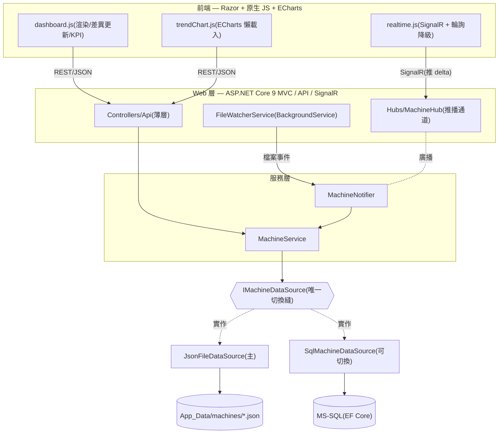

# 振動監測看板 Vibration Condition Monitoring Dashboard

一個由 **JSON 檔驅動、檔案一存檔就即時推播更新**的廠房設備振動狀態監測看板。後端讀一個資料夾裡的 JSON(一台設備一個檔),前端用深色儀表板顯示每台的**狀態燈、即時數值、迷你趨勢**;手動改任一個 JSON 存檔,對應卡片會在 1 秒內自動更新——以 `FileSystemWatcher` 偵測檔案變更 + **SignalR 只推「變動的那一台」**達成。資料來源以介面抽象,**改一行設定即可從 JSON 切換成 MS-SQL**,上層不動。

> 詳細設計理念、決策取捨與面試報告請見 [`docs/`](docs/)。

---

## ✨ 功能特色

| 功能 | 說明 |
|---|---|
| 即時看板 | KPI 統計、設備卡片網格(危險優先排序)、狀態燈、迷你趨勢圖 |
| 檔案變更即時刷新 | `FileSystemWatcher` 去抖 → SignalR 推單台 delta → 前端**差異更新**單張卡片(不整頁重抓) |
| 趨勢明細圖 | 點卡片彈出 Modal,ECharts 可移動游標 + 門檻線 + ISO 10816 分區色帶 + Y 軸縮放 + 區間切換 |
| 領域分析 | 嚴重度(值÷危險門檻)、線性回歸趨勢、母體標準差、健康率走勢、狀態轉移告警 |
| 資料來源可切換 | 同一份資料、JSON / MS-SQL 兩種後端、畫面一模一樣 |
| 韌性 | SignalR 自動重連 + 輪詢降級 + 連線狀態燈;後端統一 RFC 7807 ProblemDetails 錯誤格式 |

---

## 🧰 採用技術

### 後端
- **ASP.NET Core 9**(MVC + Web API) — 內建 DI、`BackgroundService`、SignalR
- **SignalR** — 即時推播(只推變動單台 delta),自訂 JSON 協定(camelCase + enum 字串)
- **Entity Framework Core 8**(Code-first + Migrations) — MS-SQL 可切換路徑
- **Serilog** — 結構化日誌(主控台 + 每日輪替檔)
- **Swashbuckle / Swagger** — 開發環境 API 文件
- **xUnit** — 單元 + 整合測試(`WebApplicationFactory`)

### 前端
- **Razor**(View / Partials) — 只負責外觀與掛載點,無業務邏輯
- **原生 JavaScript(IIFE 模組)+ jQuery** — 模組職責分離 + `AppState` 單一狀態源 + 事件匯流
- **Apache ECharts** — 趨勢圖(`axisPointer` 游標、`markLine` 門檻線、`markArea` 分區),**延遲載入**
- **CSS Variables** — 深色工業主題,克制 4 色(狀態色才顯眼)

### 開發方法
- **SDD(規格驅動開發)+ AI 協作** — 先寫 `docs/`(需求/架構/取捨)與 `rules/`(準則),再在約束下實作

---

## 🏗️ 系統架構



---

## 📁 專案結構

### 後端 `src/VibrationDashboard/`

```
Program.cs                      啟動:DI 註冊、中介層管線、SignalR、資料來源切換、安全標頭
Controllers/
  Api/MachinesController.cs     REST API(薄層):清單 / 明細 / 圖檔(ETag/304)
  HomeController.cs             看板首頁 + 錯誤頁
Hubs/MachineHub.cs              SignalR 單向推播通道(MachineUpdated / MachineRemoved)
Services/
  Machines/                     IMachineService + MachineService(組裝/排序/映射/ETag)
  Realtime/                     FileWatcherService(監看+去抖)、IMachineNotifier、MachineNotifier
DataSources/                    IMachineDataSource ← JsonFileDataSource(主) / Sql/SqlMachineDataSource(可切換)
  Json/MachineFileModel.cs      JSON 檔反序列化契約
Data/                           EF Core:AppDbContext、Entities、Configurations、Migrations、SqlDbInitializer
Common/
  Helpers/                      StatusEvaluator(衍生狀態)、MeasurementAnalyzer(統計/回歸)
  Exceptions/AppException.cs    自訂例外階層
  Settings/MachineDataOptions   強型別設定(門檻/筆數/資料夾)
Models/                         領域模型(來源中立):Machine、Measurement、MachineStatus
DTOs/Responses/                 對外契約(camelCase):MachineSummaryDto、MachineDetailDto、MeasurementDto
Middleware/ExceptionMiddleware  全域錯誤 → RFC 7807 ProblemDetails
App_Data/machines/*.json        JSON 假資料來源(一機一檔,15 台)
```

> **四層資料載體刻意分離**:`MachineFileModel`/`MachineEntity`(持久化) → `Machine`(領域) → `Dto`(對外),在邊界才用 `MapTo*`/`ToDto*` 轉換。**狀態不是欄位,是 `StatusEvaluator` 算出來的衍生值。**

### 前端 `src/VibrationDashboard/wwwroot/` 與 `Views/`

```
Views/
  Home/Index.cshtml             看板容器(組裝 Partials + 掛載點)
  Home/_KpiBar / _FilterBar / _OverviewPanels / _AlertsPanel
  Home/_MachineCardTemplate     卡片 <template>(JS clone)
  Home/_TrendModal              趨勢圖 Modal
  Shared/_Layout.cshtml         版面骨架(標題列 + 連線狀態 + Toast 根)
wwwroot/css/dashboard.css       深色主題(CSS 變數 + 動畫,GPU-friendly)
wwwroot/js/                     11 個 IIFE 模組,各司其職:
  api.js          AJAX 封裝 + 全域錯誤處理 + Toast + antiforgery
  shared.js       工具函式(狀態判定鏡像、formatValue、throttle/debounce)
  appState.js     單一狀態源 + 事件匯流(appState:change)
  dashboard.js    容器/協調者(載入→篩選分頁→渲染→KPI/告警→套用即時更新)
  machineCard.js  卡片渲染 + 差異更新(diff/patch/reorder)
  panels.js       KPI / 風險排行 / 告警面板
  sparkline.js    迷你趨勢(SVG)+ 健康率走勢
  trendChart.js   ECharts 趨勢圖(懶載入、游標、門檻線、分區、Y 縮放、區間)
  realtime.js     SignalR 連線 + 輪詢降級 + 連線狀態燈
  icons.js / tooltip.js  靜態 SVG / 全域 tooltip
wwwroot/lib/                    第三方:echarts、jquery、microsoft-signalr(由 libman 管理)
```

---

## 🚀 執行方式

需求:.NET 9 SDK。

```bash
# 還原 + 建置
dotnet build src/VibrationDashboard/VibrationDashboard.csproj

# 執行(預設讀 JSON,零基礎設施;首頁 http://localhost:5084)
dotnet run --project src/VibrationDashboard

# 重新產生擬真測試資料(15 台 × 40 天)
dotnet run --project tools/SeedDataGenerator -- src/VibrationDashboard/App_Data/machines
```

**資料來源切換**:於 `appsettings*.json` 設定 `DataSource:Type`(`Json` 或 `Sql`)。
- 預設 `appsettings.json` / `appsettings.Production.json` = `Json`(發布版零基礎設施)。
- `appsettings.Development.json` = `Sql`,連線字串用 `.\SQLEXPRESS` + Windows 整合式驗證(無帳密、機器無關);首次啟動會 `Migrate()` 建表並從 JSON 種子資料。

> Demo:啟動後直接編輯任一個 `App_Data/machines/*.json` 的數值並存檔,看板對應卡片會在 1 秒內即時更新。

---

## 🔌 API 端點

| 方法 | 路徑 | 說明 |
|---|---|---|
| `GET` | `/api/machines` | 設備摘要清單(不含大圖) |
| `GET` | `/api/machines/{id}` | 單台明細 + 完整量測 + 統計 |
| `GET` | `/api/machines/{id}/image` | 設備圖檔(二位元,ETag / 304 快取) |
| SignalR | `/hubs/machine` | 推播 `MachineUpdated`(單台 delta)/ `MachineRemoved` |

---

## ✅ 測試

```bash
dotnet test
```

涵蓋 **41 支測試**:
- **單元測試** — `StatusEvaluator` 門檻邊界、`MeasurementAnalyzer` 統計與邊界、`MachineService` 排序/映射/ETag/NotFound、`JsonFileDataSource` 三態/損毀檔略過/路徑穿越。
- **整合測試** — `WebApplicationFactory` 走完整管線:camelCase 序列化、例外 → ProblemDetails、圖檔 ETag/304、端到端 SignalR 推播格式。

---

## 📚 文件導覽

| 路徑 | 內容 |
|---|---|
| [`docs/`](docs/) | 需求分析、系統架構、資料來源設計、即時更新策略、視覺設計、BI 分析、**面試報告(含類圖表)** |
| [`rules/`](rules/) | 前 / 後端實作準則與命名規範 |
| [`skills/`](skills/) | FileSystemWatcher / SignalR / ECharts 技術筆記 |
| [`workflows/`](workflows/) | SDD 開發流程與任務拆解 |
