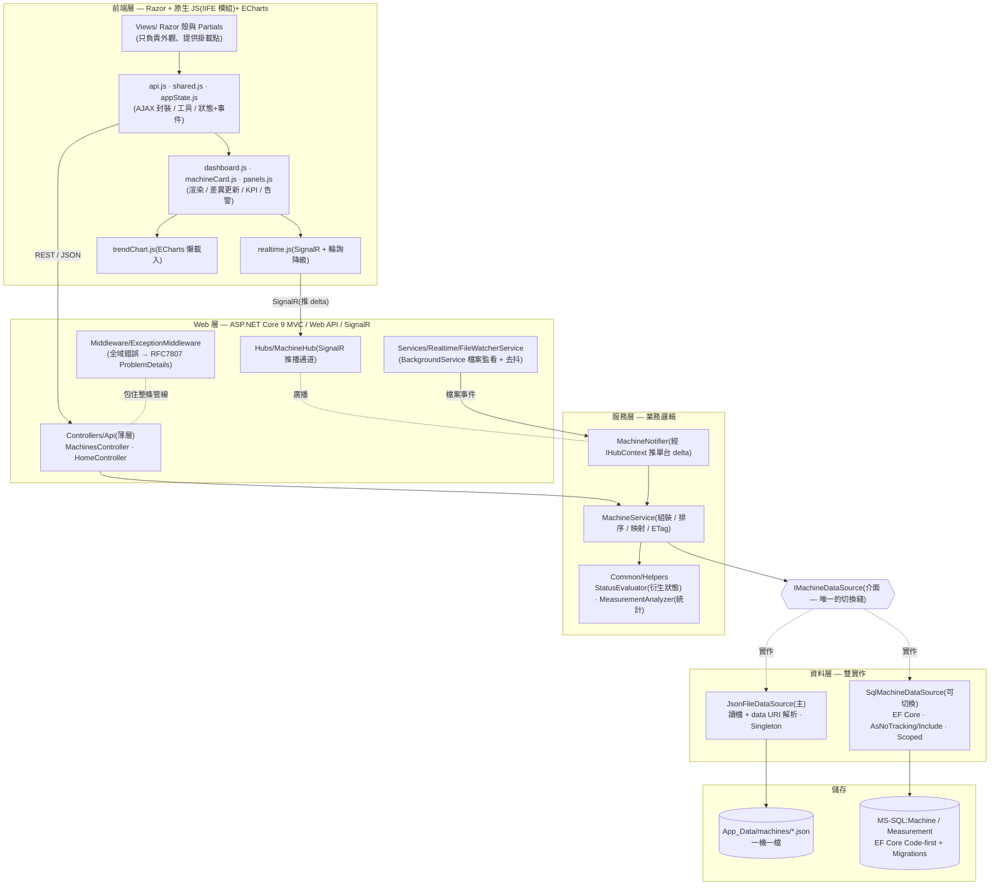
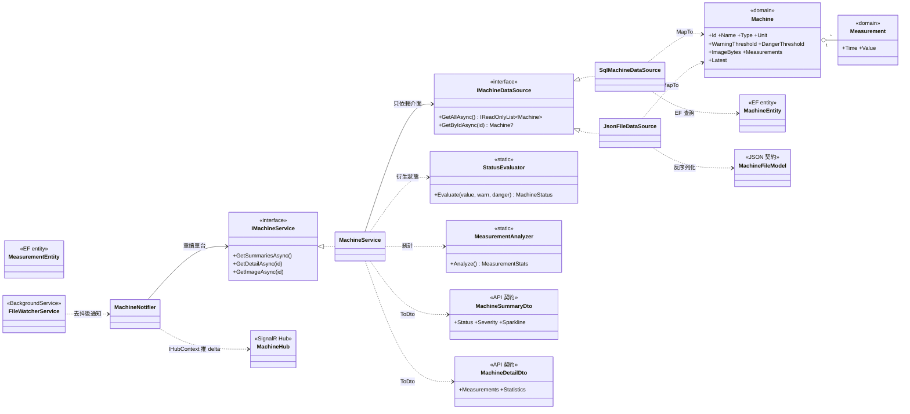

# 振動監測看板 — 專案報告(上台講稿版)

> **一句話定位**:一個由 **JSON 檔驅動、檔案一存檔就即時推播更新**的「廠房振動狀態監測看板」。後端 **ASP.NET Core 9 MVC + SignalR**、前端 **Razor + 原生 JS + ECharts**;資料來源用一個介面抽象,**改一行設定就能從 JSON 換成 MS-SQL**。整個專案以 **SDD(規格驅動)+ AI 協作**開發,先寫規格與規則、再實作。

> **這份文件怎麼用**:**§1–§7 是上台主線講稿**(約 10 分鐘,照著講即可,語氣已寫成口語);**附錄 A/B 是備查**(設計金句集 + 19 題預想問答),被追問時翻得到。Notion 內 ` ```mermaid ` 區塊可直接預覽成圖。

---

## 1. 開場:這是什麼、解了什麼題(約 1 分鐘)

各位好,我這個專案是一個**廠房設備的振動狀態監測看板**。情境是:現場每一台設備(泵浦、馬達、風機……)會持續量到一個振動值,單位是 mm/s;後端去讀一個資料夾裡的 JSON 檔,**一台設備一個檔**,前端用一個深色的儀表板把每台的**狀態燈、即時數值、迷你趨勢**呈現出來。

最關鍵的一個體驗是:**我手動去改任何一個 JSON 存檔,對應的那張卡片會在 1 秒內自己更新、自己變色、自己排序**——這是用 `FileSystemWatcher` 偵測檔案變更、再用 **SignalR 只推「變動的那一台」**做到的,不是整頁重抓。另外,資料來源我刻意用一個介面包起來,**改一行設定就能整個換成 MS-SQL,上層程式一個字都不用動**。

下面這張表是題目給的 6 大需求,以及我各自怎麼解:

| # | 需求 | 我怎麼達成 |
|---|---|---|
| 1 | 前端動態顯示檔案內容 | 後端讀 JSON →(REST API + SignalR)餵前端渲染看板 |
| 2 | FineReport 風格視覺 | 深色工業儀表板 + **克制 4 色** + ECharts(設計理據見 docs/05) |
| 3 | 名稱 / 圖檔(二位元)/ 狀態(良-異-危)/ ≥10 筆含時間數值 | `Machine` 領域模型完整呈現;圖檔走獨立 API、**狀態由門檻衍生**、量測點擴充到 40 筆 |
| 4 | 檔案更新即時刷新 | `FileSystemWatcher` 去抖 → SignalR 推單台 delta → 前端差異更新 |
| 5 | 機器數 10~20 不固定 | 程式化產生 **15 份**擬真測試檔;增 / 刪檔即時反映卡片增減 |
| 6 | 點機器看趨勢 + 可移動游標 | 點卡片彈出 Modal,ECharts `axisPointer` 可移動游標 + 門檻線 + 分區色帶 |

> **三條金句先放這(架構 / 即時 / 資料分流)**,後面會展開:
> 1. **可維護性**:「換資料來源只要改一行設定,不動 Controller、Hub、前端——這就是 `IMachineDataSource` 介面雙實作的價值。」
> 2. **即時更新**:「複雜看板用推播**反而比盲輪詢省**——盲輪詢每幾秒把 20 台全撈一遍且多半沒變;SignalR 只在某台真的變了才推那一台。」
> 3. **資料分流**:「不同資料用最適手段:清單 / 狀態走 SignalR delta、圖檔走 HTTP + ETag 快取(完全不輪詢)、完整趨勢點機器才懶載入。」

---

## 2. 專案結構與職責分區(類圖表,約 1.5 分鐘)

我先用兩張圖把整個專案「誰負責什麼、用了什麼技術」講清楚,後面講功能就有地圖可對。

### 2.1 分層架構 × 技術應用圖

> 看圖的重點:**相依只由上往下、邊界一律 DTO、整條資料流只認 `IMachineDataSource` 這個縫。**



### 2.2 核心類別關係圖(UML)

> 看圖的重點:**四種資料載體刻意分離**(持久化 Entity / 領域 Model / 對外 DTO / JSON FileModel),在邊界才用 `MapTo*`、`ToDto*` 轉換;**狀態不是欄位,是 `StatusEvaluator` 算出來的衍生值**。



### 2.3 資料夾職責 × 技術對照表

| 區塊 | 職責 | 應用技術 |
|---|---|---|
| `Controllers/Api` · `HomeController` | 接請求、回 DTO 的**薄層**,不碰資料來源 | ASP.NET Core MVC / Web API、屬性路由、ProblemDetails |
| `Hubs/MachineHub` | SignalR 推播通道(只廣播,前端不回呼方法) | SignalR、自訂 JSON 協定(camelCase + enum 字串) |
| `Services/Machines` | 業務組裝:排序(危險優先)、映射、ETag、衍生狀態 | DI Scoped、SHA-256 ETag |
| `Services/Realtime` | 檔案監看 + 去抖 + 推單台 delta | `BackgroundService`、`FileSystemWatcher`、`IServiceScopeFactory`、`IHubContext` |
| `DataSources` + `IMachineDataSource` | **唯一的資料來源切換縫**(JSON 主 / SQL 可切換) | 策略模式 + 依賴反轉、`System.Text.Json` |
| `Data`(Entities / Configurations / Migrations) | SQL 持久化:正規化 schema、索引、種子初始化 | EF Core 8、Code-first Migrations、Fluent API |
| `Common`(Helpers / Exceptions / Settings) | 領域邏輯:門檻判定、統計、自訂例外、強型別設定 | 線性回歸 / 母體標準差、`IOptions<T>` |
| `Models` · `DTOs` | 領域模型 / 對外契約(四層載體分離) | C# `record` / `init`-only 不可變模型 |
| `Middleware` | 全域錯誤攔截 + 安全標頭 | RFC 7807 ProblemDetails、Serilog、CSP / 安全標頭 |
| `wwwroot/js`(11 個模組) | 取資料 / 狀態 / 渲染 / 即時 / 圖表,各司其職 | 原生 JS(IIFE)、jQuery、ECharts、SignalR JS client |

### 2.4 專案結構速覽(資料夾 → 一句話職責)

> 上表(§2.3)按「技術」分組;這張按「資料夾」逐一對照,適合照著目錄從上到下講一遍。重點修正三個常見誤解:**Hubs 不是沒用**(SignalR 單向推播通道)、**Models 是來源中立的領域模型**(不是資料庫物件)、**wwwroot 不只 CSS**(JS 11 模組 + 第三方 lib + CSS)。

| 資料夾 | 職責(一句話) | 對應技術 |
|---|---|---|
| `App_Data/machines` | JSON 假資料來源(一機一檔) | `System.Text.Json` |
| `Controllers` | 對外接口**薄層**,回 DTO | ASP.NET Core MVC / Web API |
| `Hubs` | SignalR **單向推播通道**(改檔即時更新的出口) | SignalR(`IHubContext` 推、`MapHub` 掛端點) |
| `Services` | 業務邏輯層 + **即時**(檔案監看 / 推播) | DI、`BackgroundService`、`FileSystemWatcher` |
| `DataSources` | **資料來源切換縫**(JSON / SQL ← `IMachineDataSource`) | 策略模式 + 依賴反轉 |
| `Data` | EF 持久化:Entities / 設定 / Migrations / 連線 | EF Core Code-first、Fluent API |
| `Models` | **領域模型(來源中立)** | C# `record` / `init`-only |
| `DTOs` | 對外契約(前後端轉換,camelCase) | `record` |
| `Common` | 例外 + **Helpers(衍生狀態 / 統計)** + 強型別設定 | `StatusEvaluator` / `MeasurementAnalyzer`、`IOptions<T>` |
| `Middleware` | 全域錯誤處理 → ProblemDetails | RFC 7807 |
| `Views` | 前端頁面(Razor 殼 + Partials) | Razor |
| `wwwroot` | 前端靜態資產:**JS 11 模組 + lib + CSS** | 原生 JS / jQuery / ECharts / SignalR JS client |
| `logs` | Serilog 輸出(主控台 + 每日輪替) | Serilog |

---

## 3. 技術選型與對比(約 1.5 分鐘)

每一層我都問過自己「為什麼是它、代價是什麼」,而不是預設值帶過:

| 層 | 技術 | 為什麼選 | 取捨 |
|---|---|---|---|
| 後端 | **ASP.NET Core 9 MVC + Web API** | 對接職缺;DI、`BackgroundService`、SignalR 都是內建一等公民 | 現代、跨平台、好測試;可掛 IIS |
| 即時 | **SignalR** | 檔案變更時主動推、低延遲、只推 delta | 比輪詢省;需環境支援 WebSocket(故做輪詢降級) |
| 資料(主) | **JSON 檔** | 需求 4 本質是**檔案監看**情境,`FileSystemWatcher` 原生可偵測增 / 改 / 刪 | 零基礎設施、丟檔就能 demo;查詢 / 併發弱 |
| 資料(可切換) | **MS-SQL + EF Core(Code-first)** | 展示資料庫設計 / 正規化能力 | 索引查詢、交易強;需 DB 環境 |
| 前端 | **Razor + 原生 JS + jQuery** | 對接職缺技能(HTML/CSS/JS/jQuery) | 無建置工具、相容性好;非 SPA 框架 |
| 圖表 | **Apache ECharts** | 內建可移動游標(`axisPointer`)、門檻線、分區色帶,最貼近附圖 | 功能完整;體積大 → **延遲載入** |
| 部署 | **IIS(ASP.NET Core Module)** | 題目指定、職缺要求 | 反向代理到 Kestrel;需開 WebSocket |
| 記錄 | **Serilog** | 結構化日誌,主控台 + 每日輪替檔(保留 14 天) | 取代預設 ILogger;`traceId` 可對到錯誤回應 |

> **為什麼不用 .NET Framework 傳統 MVC?** 本機只裝 .NET 9 SDK;ASP.NET Core 更現代、同樣能掛 IIS,介面 / DI / `BackgroundService` / SignalR 全內建。
>
> **為什麼前端不上 React / Vue?** 職缺要的是 HTML/CSS/JS/jQuery;這個規模(10~20 台)用原生 IIFE 模組 + 事件匯流就夠清楚,還省掉整套建置工具鏈。我用「模組職責分離 + AppState 單一狀態源」把可維護性補回來。

---

## 4. 核心功能逐一講(功能 + 決策考量 + 技術對比,約 4 分鐘)

### 4.1 資料來源一鍵切換(JSON ↔ SQL)

**做什麼**:Service 只依賴 `IMachineDataSource` 介面,不認得 JSON 或 SQL 的具體型別。`Program.cs` 讀 `DataSource:Type`,把 `JsonFileDataSource`(Singleton)或 `SqlMachineDataSource`(Scoped)其中一個註冊成這個介面。

**決策考量**:這不是「為抽象而抽象」。團隊既有專案(ReactL.api)是 Service 直接握 `DbContext`;但這題明確要「JSON 或 SQL 可切換」,所以我**只在 Service 與資料之間多加這一層介面**——抽象是被需求驅動的。

**端到端證據**:切到 SQL 時,`SqlDbInitializer` 啟動會先 `Migrate()` 建表,**空庫時直接複用 `JsonFileDataSource` 讀同一份 JSON 種子進庫**。所以是「**同一份資料、兩種後端、畫面一模一樣**」——這就是抽象正確的端到端證明。要再接第三方 API,也只是多寫一個 `class XxxDataSource : IMachineDataSource` 加一個註冊分支,上層全不動。

### 4.2 即時更新:FileSystemWatcher + SignalR vs 輪詢

**做什麼**:改 JSON 存檔 → `FileSystemWatcher` 收事件 → **400ms 去抖**(一次存檔常觸發多個事件,只處理最後一個)→ 重讀那一台、重算狀態 → `MachineNotifier` 經 `IHubContext` 推 `MachineUpdated`(單台 DTO)→ 前端 `realtime.js` 收到 → **只差異更新那一張卡片**。連不上時自動降級成每 5 秒輪詢,右上角有連線狀態燈(綠 / 琥珀 / 紅)。

**決策考量 — push 還是 poll?** 我的判準不是「資料複不複雜」,而是「**源頭能不能主動通知**」:

| 面向 | 輪詢 Poll | 推播 Push(本案) |
|---|---|---|
| 沒變化時 | 照樣每 N 秒整批撈(浪費) | 不傳輸 |
| 延遲 | = 輪詢間隔 | 近即時(<1 秒) |
| 頻寬 | 每次整批 | **只傳變動那一台 delta** |
| 用戶端擴展 | 線性放大(人數 × 頻率) | 一條長連線、一次推播 |

檔案系統偵測得到變更,所以選 push;**輪詢是降級備援**,它的正當主場是「源頭無法通知」(查無 webhook 的第三方系統)。

> **踩到的坑(展現深度)**:SignalR 有**獨立的序列化器**,預設會把 enum 推成數字、命名也跟 REST 不一致,導致前端 `dto.status` 對不上而**靜默失效**。我用 `AddJsonProtocol` 設成 camelCase + enum 字串修正,而且是**靠端到端 SignalR 用戶端測試**抓出來的。另外 `FileWatcherService` 是 Singleton、推播器是 Scoped,我用 `IServiceScopeFactory` 每次事件開 scope 解析,避免 captive dependency。

### 4.3 看板視覺與差異更新

**做什麼**:深色工業底 + **克制 4 色**(深藍底、單一青色當主色,綠 / 黃 / 紅只保留給狀態與越線點)。平常整個畫面幾乎是灰階,**狀態色一出現就極度顯眼**。卡片網格危險優先排序,KPI 列、狀態分布長條(可點擊篩選)、健康率走勢、Top 5 風險排行。

**決策考量 — 差異更新**:收到單台 delta 時,我**只重繪那一張卡的變動欄位**,不重建整個 DOM。好處是不閃爍、不丟使用者的 hover 與選取狀態、效能也省;轉危險時才額外給紅色脈衝 + 排到最前。對應 ISO 10816 的振動嚴重度分區:Zone A/B = 良好(綠)、Zone C = 異常(黃)、Zone D = 危險(紅)。

### 4.4 趨勢圖(ECharts)

**做什麼**:點卡片彈出 Modal,**首次點擊才懶載入 ECharts**(省掉大部分使用者的初始載入)→ 打 `GET /api/machines/{id}` 拿完整 40 筆 → 畫趨勢線 + `axisPointer` 可移動游標 + tooltip + `markLine` 門檻線 + `markArea` 分區色帶 + 越線點放大 + `dataZoom` **Y 軸縮放**;時間區間「全部 / 7 天 / 30 天 / 自訂」,**預設 30 天**;關閉 Modal 才 `dispose`。

**決策考量 — 為什麼預設 30 天、不放年 / 季?** 這張圖同時服務「近期即時觀察」與「歷史回溯」;監管系統的決策重心是「**現在要不要處理**」,所以權重壓在近期。不放年 / 季是因為目前資料粒度是每日一筆,「全部」已是長期視圖,年 / 季與它幾乎重疊、甚至空白反而像壞掉。**原則:預設區間要對齊資料的實際跨度與粒度。**

### 4.5 領域分析(這題真正的「懂行」加分點)

- **嚴重度 Severity = 最新值 ÷ 危險門檻**:不同設備門檻天差地遠(精密主軸 0.3/0.5、一般馬達 1.8/2.8、大型風機 2.8/4.5),**不能拿原始 mm/s 跨機比較**,正規化後才能排 Top 5 風險。
- **趨勢方向**:後端 `MeasurementAnalyzer` 對整段做**最小平方法線性回歸**,斜率即「每日變化量」;`|斜率| < 0.005` 設死區過濾雜訊,正=惡化、負=改善。
- **狀態 vs 趨勢是兩個指標**:狀態看**最新一筆值**(瞬時),趨勢看**整段回歸斜率**(方向)。某台連漲九天、末日驟降一筆,狀態回到良好但趨勢仍惡化中——**一天的下殺扳不倒九天的上升**,這不是 bug。
- **健康率走勢**:用每台既有量測**回推歷史**(良好 ÷ 總數逐期重算),一載入就有方向線;告警面板只記**狀態轉移**(升級 / 恢復),首次出現、同態不變都不記,避免洗版,且判斷基準取自**全廠全量**(非當前頁 DOM),離頁機台升級也不漏。

### 4.6 設備類型 metadata

每台多帶一個 `Type`(泵浦 / 馬達 / 齒輪箱 / 壓縮機 / 風機 / 主軸 / 鼓風機 / 冷水機 / 軸承,共 9 類),**貫穿四層**(JSON `type` 欄位 → `Machine.Type` → DTO → 卡片類型標籤),搜尋框也吃類型字。SQL 路徑用 `AddMachineType` migration 補上 `Type` 欄位。這讓「為什麼門檻不能全域寫死」有了具體載體——不同類型本來就該有不同門檻。

### 4.7 狀態為衍生值・三層模型分離

狀態(良好 / 異常 / 危險)**一律是衍生值**,由 `StatusEvaluator` 用「最新值 vs 門檻」即時算,**不存進模型或資料庫**——避免「值更新了、狀態忘了改」的更新異常,單一真相。三種模型刻意不共用:`MachineEntity`(持久化、只在 SQL 路徑)、`Machine`(領域、來源中立)、`Dto`(對外契約、camelCase)。因為**存的格式、領域的概念、對外的契約會各自獨立演化**,混用會讓「改資料庫欄位」連帶「前端壞掉」。

---

## 5. 運行流程三條(約 1 分鐘)

**① 初次載入**
`GET /` → 看板殼 + 骨架屏 → `api.js` 打 `GET /api/machines`(摘要,不含大圖)→ 批次渲染卡片(危險優先)→ 算 KPI → 圖檔由各卡 `` 走 `/api/machines/{id}/image`(ETag/304 快取)。

**② 即時更新(需求 4 核心)**
改 JSON 存檔 → `FileSystemWatcher` → 400ms 去抖 → 重讀重算 → 推 `MachineUpdated`(單台)→ `Dashboard.applyUpdate` 差異更新該卡 + 重算 KPI +(轉危險)脈衝 / 排前 / 記告警。連不上自動降級每 5 秒輪詢。

**③ 明細趨勢(需求 6)**
點卡片 → Modal → 懶載入 ECharts → `GET /api/machines/{id}`(完整 40 筆)→ 趨勢線 + 游標 + 門檻線 + 分區 + Y 軸縮放 + 區間切換 → 關閉才 `dispose`。

---

## 6. 工程品質(收尾,約 1 分鐘)

- **測試**:`dotnet test` **41 支全綠**(單元 + 整合)。單元測試驗「零件算得對」(`StatusEvaluator` 門檻邊界、`MeasurementAnalyzer` 統計與零跨度、`MachineService` 排序 / 映射 / ETag / NotFound、`JsonFileDataSource` 三態 / 損毀檔略過 / 路徑穿越);整合測試用 `WebApplicationFactory` 走完整管線,驗單元碰不到的對外行為(camelCase 序列化、例外 → ProblemDetails、ETag/304、**端到端 SignalR 推播格式**)。
- **錯誤處理 / 韌性**:後端自訂 `AppException` + 全域 `ExceptionMiddleware` → RFC 7807 ProblemDetails(camelCase,含 `errorCode` / `traceId`);前端集中 `ajaxError` + Toast + `window.onerror`;SignalR `withAutomaticReconnect` + 輪詢降級 + 連線狀態燈。
- **資安(已實作,非規劃)**:前端注入一律 `.text()` / `<template>`(防 XSS)、antiforgery header、設備 id 白名單防路徑穿越;後端 `Program.cs` 已設**安全標頭**(`X-Content-Type-Options: nosniff`、`X-Frame-Options: DENY`、`Referrer-Policy: no-referrer`)與**非開發環境 CSP**(`connect-src` 放行 `ws:`/`wss:` 供 SignalR);圖檔來源做 **MIME 白名單**(只允 png/jpeg/webp/gif,擋掉 SVG)。
- **效能**:差異更新、ECharts 延遲載入 + 實例重用、resize throttle、圖檔 ETag/304、`DocumentFragment` 批次 DOM。
- **可及性(a11y)**:語意標籤、狀態不只靠顏色(補文字 + `aria-label`)、`aria-live` 即時數值、Modal 焦點管理 + Esc。

---

## 7. 收尾金句 + Demo 腳本

> **一句話收尾**:「我把它做成『**對的抽象 + 對的即時策略 + 懂這個領域**』——資料來源換 JSON/SQL 只改一行設定、即時更新只推變動那一台、而 severity / 趨勢回歸 / 健康率這些是針對振動監測場景算出來的,不是套版。」

**Demo 腳本(現場操作)**
1. 開看板 → 講 KPI(良 / 異 / 危)、危險卡片排最前、狀態燈、迷你趨勢。
2. **改一個 JSON 的 value 存檔** → 該卡即時跳動、轉危險脈衝 + 排到最前 + 告警 +1(需求 4)。
3. **刪一個檔 / 複製新增一檔** → 卡片即時減 / 增(需求 5)。
4. 點卡片 → Modal 趨勢圖,移動游標看各點數值、門檻線 / 分區(需求 6);切 30 天 / 全部 / 自訂;挑尖峰大的(如 G01)拉右側滑桿**縮放 Y 軸**看低值細節、雙擊還原。
5. (選)`appsettings` 把 `DataSource:Type` 改 `Sql` → 重啟,**畫面一模一樣**(架構賣點)。

> **對應評分**:架構 / 可維護性(§2、§4.1、§4.7)、視覺設計(§4.3、a11y)、設計創意(§4.4、§4.5、ISO 對接 / 告警轉移)、AI 協助(附錄 B-Q9 / docs/06)。

---

# 附錄 A:關鍵設計決策金句集(備查)

- **資料來源抽象**:策略模式 + 依賴反轉;切 `DataSource:Type` 一行,上層全不動。
- **push vs poll**:決定因素是「源頭能否主動通知」——檔案系統偵測得到故選 push;輪詢是降級且有正當主場(源頭不能通知時)。(完整框架見 docs/04 §7)
- **SignalR ≠ WebSocket**:WebSocket 是底層管子,SignalR 是「管子＋傳輸協商(WS→SSE→LongPolling)＋自動重連＋RPC」的整套方案;本案再外加一層「整個連不上 → HTTP 輪詢」降級,共兩層保險。(見 B-Q17)
- **告警 = 純前端衍生、不落地**:通道只送單台當下快照,前端拿它比 `AppState` 記憶體裡的舊狀態算出「轉移」;後端無告警概念、DB 只有 Machines/Measurements 兩張表。(見 B-Q18)
- **前端分工**:邏輯歸 vanilla JS、畫面歸 jQuery、狀態歸 `AppState`——「比較」不是 jQuery 做的。(見 B-Q19)
- **狀態為衍生值**:不入庫,集中由 `StatusEvaluator` 算,避免更新異常。
- **差異更新**:收 delta 只重繪那張卡,不重建整個 DOM——避免閃爍、不丟 hover / 選取、省效能。
- **告警 = 狀態「轉移」流,不是異常計數**:只在升級 / 恢復才記一筆,最新 50 筆、點一筆跳那台趨勢;判斷基準取自全廠全量(非當前頁 DOM)。(規則見 docs/05 §7.1)
- **狀態分布可篩選 + 看方向**:三色長條每段可點擊篩選(複用 KPI/`#filter-status` 同一接縫);底部健康率走勢用每台既有量測回推歷史,一載入就有方向線。(算法見 docs/07 §6.1)
- **趨勢區間預設近期**:全部 / 7 天 / 30 天 / 自訂,預設 30 天;不放年 / 季(對齊不了每日粒度、且被「全部」涵蓋)。(見 B-Q14)
- **統一錯誤格式**:自訂 `AppException` + 全域 `ExceptionMiddleware` → RFC 7807 ProblemDetails(camelCase,含 `errorCode`/`traceId`)。
- **手動刷新 = 備援**:主路徑已即時,手動刷新刻意做成差異更新、不清空,但補上輕量回饋(忙碌態 +「已更新」Toast)。
- **查詢 / 篩選 / 分頁(分階段 + 預留接縫)**:現在前端對全量做、API 契約先定;核心取捨是「**分頁不能弄壞全廠彙總**」——KPI / 排行來源與「當前頁」解耦。(見 docs/07 §5.3、B-Q12)

---

# 附錄 B:預想 Q&A(19 題,備查)

**Q1. 為什麼用 JSON 不用資料庫?JSON 真的比較快嗎?**
不是天生比較快,**看存取模式**:小檔整份讀、不查詢 → JSON 快;大量篩選 / 聚合 / 歷史 → SQL(有索引)遠快。這題選 JSON 的**主因不是速度,而是需求 4 本質是「檔案系統變更」情境**,`FileSystemWatcher` 能原生偵測。我同時做了 SQL 可切換來展示資料庫能力。

**Q2. 為什麼用 SignalR 不用輪詢?輪詢何時用?**
決定因素是「源頭能否主動通知」。檔案系統偵測得到變更 → 用 push,低延遲、只傳變動那一台。**輪詢的主場是「源頭無法通知」**(查第三方 API、無 webhook 的系統),或延遲容忍高、要極簡無狀態時。我兩者都做:預設 push,連不上才降級輪詢。

**Q3. 為什麼狀態不存進資料庫?**
狀態是「最新值 vs 門檻」的**衍生值**。存死會有更新異常(值改了狀態忘了改)。集中由 `StatusEvaluator` 即時算,單一真相。

**Q4. 圖檔為什麼走獨立 API?**
base64 內嵌 JSON 會膨脹約 33% 且每次讀都解析。改走 `GET /{id}/image` + **ETag/304**:看板初次載入不夾大圖,之後重整都回 304 不重傳,15 張圖省很多頻寬。ETag 取圖檔位元組的 SHA-256 前 16 bytes。

**Q5. 怎麼確保切換 JSON/SQL 不動上層?**
`IMachineDataSource` 介面 + DI 依設定注入具體實作。Service 只依賴介面;`SqlDbInitializer` 還沿用 JSON 來源種子,證明同資料兩後端同畫面。

**Q6. 開發中踩到什麼坑?(展現深度)**
① **SignalR 有獨立序列化器**:預設把 enum 推成數字、命名也與 REST 不一致 → 前端 `dto.status`/`dto.id` 對不上而靜默失效。用 `AddJsonProtocol` 設 camelCase + enum 字串修正,**靠端到端測試抓出來**。
② **Captive dependency**:`FileWatcherService` 是 Singleton,要用 Scoped 推播器 → 用 `IServiceScopeFactory` 每次事件開 scope 解析。
③ **讀到寫一半的檔**:去抖 + 讀檔失敗略過 + 產檔端原子寫(tmp→rename)。
④ **`--no-build` 用到舊 View**:Razor View 預設編譯期編進組件,`.cshtml` 改過卻沒重建會跑舊 View、前端靜默載不到新依賴。修法:**開發環境**啟用 Razor 執行階段編譯(`AddRazorRuntimeCompilation()`,僅 `IsDevelopment()`);上機維持編譯期 View、零影響。(細節見 docs/02 §8)

**Q7. 怎麼擴展到大量資料?**
切到 SQL 路徑:靠 `(MachineId, MeasuredAt DESC)` 索引取最近 N 筆;清單分頁;趨勢**降採樣在後端做**,前端只負責呈現。

**Q8. IIS 部署要注意什麼?**
裝 ASP.NET Core Hosting Bundle;Application Pool 設「**No Managed Code**」(Kestrel 跑 .NET、IIS 當反向代理);**啟用 WebSocket**(SignalR 才走 WS,否則退 SSE / long-polling);安全標頭 / CSP 的 `connect-src` 要放行 `ws:`/`wss:`。**若該站台走 SQL**,另需在本機 SQL 幫 **App Pool 身分**開登入(`CREATE LOGIN [IIS APPPOOL\站台名] FROM WINDOWS` + `WebTest` 的 `db_owner`)——IIS 行程的 Windows 身分是 App Pool 而非你的帳號(完整策略見 docs/03 §6)。

**Q9. 你怎麼用 AI 協助開發?**
**SDD 規格驅動**:先把需求、架構、資料 / 即時 / 視覺設計寫成 `docs/`,把開發準則寫成 `rules/`,再讓 AI 在規格與規則約束下實作,每個決策要求解釋原理、人做最終把關、按 Phase 小步驗證。好處:產出有依據、可維護、講得出「為什麼這樣做」。

**Q10. 正式部署要把資料源切到 SQL,設定放哪?appsettings 還是 web.config?**
**以 appsettings 為主**。理由:① web.config 只在 IIS 下生效——本機 `dotnet run` / IIS Express demo 根本不讀它;appsettings / 命令列覆寫則任何執行方式一致。② appsettings 是 ASP.NET Core 標準分層設定,可攜(IIS/Docker/Linux 通用)、好版控。③ 關注點分離:web.config 管「怎麼啟動程序」,資料源選擇是應用設定。
**現況**:本案方向是**開發者用 SQL、發布版用 JSON**——`appsettings.Development.json` 設 `Type=Sql` 並放 `.\SQLEXPRESS` + Windows 整合式驗證的連線字串;base / Production 維持 `Type=Json`。若刻意要 IIS 改用 SQL,再於該環境覆寫(`web.config` 用 `<aspNetCore><environmentVariables>`,鍵名 `DataSource__Type` 雙底線,**不是** `<appSettings>`)並授權 App Pool 身分(見 Q8)。

**Q11. 後端失敗為什麼回 ProblemDetails,而不是自訂 `{success, code, message, data}`?**
ProblemDetails 本身就是「標準化的錯誤物件」——已含 `errorCode` + 包裝原因 + `traceId` + `status`,由全域 `ExceptionMiddleware` 對所有端點統一產生。

| 面向 | ProblemDetails + HTTP 狀態碼(採用) | Envelope `{success,...}` |
|---|---|---|
| HTTP 狀態 | 成功 2xx / 失敗 4xx–5xx,語意正確 | 永遠 200,靠 `success` 判斷 |
| 前端分流 | 直接看 `jqXHR.status` | 每次拆 body 看 `success` |
| 標準 / 工具 | RFC 7807 國際標準,工具都認得 | 自訂,工具不認得 |

`traceId` 同時出現在錯誤回應與後端 log,拿到就能回頭對到那筆 log。

**Q12. 看板要加查詢 / 篩選 / 分頁,大量設備下怎麼設計?會不會弄壞即時看板?**
看板有三種擴展特性不同的東西:**清單檢視**、**全廠彙總(KPI/健康率/風險)**、**即時 delta**——不能混為一談,**分頁不能弄壞彙總**。我採分階段 + 預留接縫:**現在**(10~20 台,已實作前端版)查詢 / 篩選 / 排序 / 分頁都在前端對全量做、KPI/排行維持前端 rollup,零後端負擔,清單查詢收斂成單一接縫 `listQuery(...)`;**未來**(數百台)接縫翻後端 `GET /api/machines?...` + `GET /api/machines/stats`,SignalR 改推「彙總快照 + 當前頁失效訊號」。儀表板本來就不是資料表格,真要「瀏覽全部 + 分頁」的是管理清單頁(`/admin`)。

**Q13. 「趨勢」怎麼算?為什麼數值掉回健康、趨勢還顯示惡化中?**
後端 `MeasurementAnalyzer` 對整段做最小平方法線性回歸,斜率 `= Σ(x−x̄)(y−ȳ)/Σ(x−x̄)²` 即每日變化量;前端依斜率轉三態,`|斜率| < 0.005` 設死區。狀態看最新一筆值(瞬時)、趨勢看整段回歸斜率(方向);連漲九天末日驟降一筆,最新值回良好但斜率仍正 → 趨勢惡化中,一天下殺扳不倒九天上升,不是 bug。

**Q14. 趨勢圖區間為什麼是「全部 / 7 天 / 30 天 / 自訂」、預設 30 天?不放年?**
這張圖同時承擔「近期即時觀察」與「長期回溯」;監管決策重心在近期,故預設壓在 30 天;保留全部 / 自訂讓想看歷史的人也能篩。不放年 / 季是因為目前資料粒度每日一筆,「全部」已是長期視圖,年 / 季與它重疊甚至空白。原則:**預設區間要對齊資料的實際跨度與粒度**。

**Q15. DB 連線帳密怎麼管?會上到不同機器又怎麼處理?**
核心原則:**repo 永遠不放真實憑證**。本案直接把問題消掉:① 用 **Windows 整合式驗證**(`Trusted_Connection=True`)→ **根本沒有帳密**;② Server 用 **`.\SQLEXPRESS`**(`.`=本機)→ 機器無關。所以連線字串可安心放進版控的 `appsettings`(放 Development.json),任何開發機通用。**澄清**:「加密 appsettings」是 .NET Framework(`aspnet_regiis`)的做法,.NET Core 沒有內建;Core 對機敏資料的正解是環境變數 / 祕密庫 / User Secrets。

**Q16. 單元測試和整合測試差在哪?各做了哪些?**
**單元測試** = 確保功能邏輯內部的計算 / 運行正確(隔離單一零件、不啟動 app)——`StatusEvaluator` 門檻邊界、`MeasurementAnalyzer` 統計與邊界、`MachineService` 排序 / 映射 / ETag / NotFound、`JsonFileDataSource` 三態 / 損毀檔略過 / 路徑穿越。**整合測試** = 對格式、實際流動、錯誤處理做驗證(啟動整個 app、從 HTTP/Hub 入口打進去)——`WebApplicationFactory` 走完整管線,驗 camelCase 序列化、例外 → ProblemDetails、ETag/304、SignalR 推播格式。目前 **41 支全綠**。

**Q17. SignalR 跟 WebSocket 是同一個東西嗎?**
不是。**WebSocket 是一條全雙工連線的底層協定(管子);SignalR 是架在它之上的高階即時函式庫**,自動幫你做三件 WebSocket 本身不管的事:

| SignalR 多做的事 | 內容 |
|---|---|
| **傳輸協商** | 優先 WebSocket → 不支援退 Server-Sent Events → 再退 Long Polling,程式碼一行不改 |
| **自動重連** | `withAutomaticReconnect()`,短暫斷線自動拉回 |
| **RPC 式呼叫** | 後端 `IHubContext.SendAsync("MachineUpdated", dto)`、前端 `conn.on("MachineUpdated", …)`,不用自己解析訊息框 |

本案還在 SignalR 之外**再疊一層降級**:整個連不上(IIS 沒開 WebSocket、函式庫沒載入)→ 改每 5 秒打 REST API 重抓。所以是**兩層保險**:`WebSocket→SSE→LongPolling`(SignalR 內建協商)外加 `→ HTTP 輪詢`(本案自寫),右上角連線燈顯示現在走哪種。一句話:**WebSocket 是管子,SignalR 是「管子＋協商＋重連＋RPC」的整套方案**——我選它是為了這套韌性,不是自己手刻 WebSocket。

**Q18. 告警事件到底怎麼判定?存在哪裡?**
**判定 = 狀態「轉移」(edge-triggered),不是時間窗、也不是當下計數**:拿這次推播的狀態比上一次的狀態,**不同才記一筆**;首次出現(無前值)或同態不變都不記,避免洗版,再用 `statusRank` 比大小標「升級 / 恢復」。三個關鍵點:

- **純前端衍生,後端沒有「告警」概念**:SignalR 通道只送「這台現在長這樣」的單台摘要(狀態＋最新值),**沒有升級/恢復欄位**;對照組(前一次狀態)不在通道裡,而是存在前端 `AppState` 記憶體——是前端拿「通道送來的新值」比「自己記得的舊值」算出來的。
- **不落地**:SQL 模式資料庫只有 `Machines`、`Measurements` 兩張表,**沒有告警表**;告警只活在瀏覽器(最多 50 筆),重整或按「清除」就沒了。
- **為什麼這樣設計**:demo 範圍的刻意取捨——展示「即時轉移偵測」就夠。正式系統會把告警寫進專門的告警表,帶確認 / 已讀 / 靜音 / 升級通知等狀態機。這樣講能展現「我知道 demo 版與正式版差在哪」。

**Q19. 即時更新的「比較」是 jQuery 做的嗎?前端各工具怎麼分工?**
**不是,比較邏輯是純 JavaScript,jQuery 沒參與判斷。** 容易誤會,所以把分工講清楚:

| 職責 | 由誰做 |
|---|---|
| 判斷要不要告警 / 算狀態轉移(`prevStatus !== dto.status`、`statusRank`) | **vanilla JS**(`dashboard.js`/`panels.js`),完全沒用 jQuery |
| 發 AJAX(輪詢降級時打 REST API) | jQuery |
| 操作 DOM(把算好的清單 / 卡片 `.text()`/`.append()` 畫上去,`.text()` 同時防 XSS) | jQuery |
| 狀態保管(全廠機台快照 + 事件匯流) | **`AppState`**(自寫單一狀態源),不是 jQuery |

一句話:**邏輯歸 vanilla JS、畫面歸 jQuery、狀態歸 AppState**——這正是我前端「模組職責分離」的體現,而不是把所有東西塞進 jQuery 的 callback。
