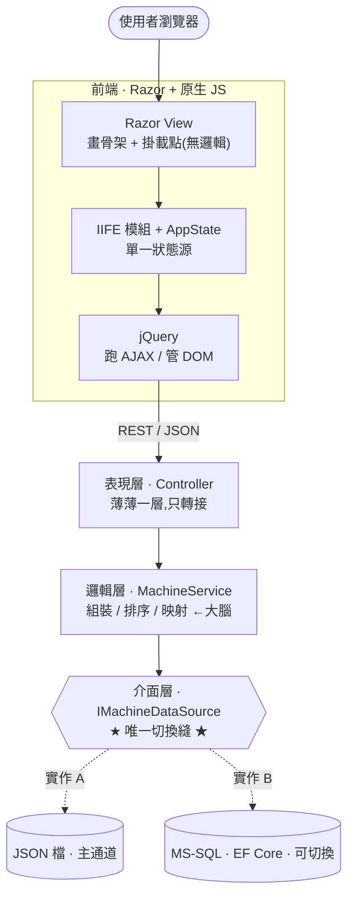
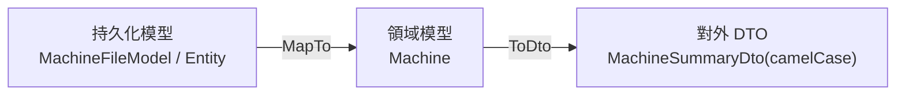

# 架構記憶圖(報告用・Notion 可直接預覽)

> **用途**:上台報告時的「**架構記憶點**」精簡版。整份只圍繞 **3 個記憶點**,每個配一張小圖 + 一句講法 + 一點知識補充。
> **怎麼用**:Notion 內貼上後,` ```mermaid ` 區塊會直接預覽成圖。詳細逐章講稿見 [`08_面試報告.md`](08_面試報告.md)。
> **口訣**:**「一條縫、一存檔、三件衣服」** —— 這三句一出來,整個架構就講完了。

---

## 🎯 三個記憶點(報告骨架)

| # | 記憶點(一句話) | 對應技術 | 想展現的能力 |
|---|---|---|---|
| **1** | **「一條縫」** 改一行設定就換資料來源 | `IMachineDataSource` | 依賴反轉、對介面寫程式 |
| **2** | **「一存檔」** 改 JSON → 卡片 1 秒內變 | `FileSystemWatcher` + SignalR | 即時推播、只推變動 |
| **3** | **「三件衣服」** 資料進出各換一次裝 | FileModel/Entity → Machine → DTO | 邊界轉換、資料不汙染 |

---

## 1️⃣ 主架構 — 一條縫(請求的旅程)

> **講法**:「一個請求由上往下走,**到介面層這條縫為止,上層都不知道資料是 JSON 還是 SQL**。」



**🧠 知識補充(順口帶一句即可):**
- 上層只依賴**抽象**`IMachineDataSource`,不依賴具體的 JSON/SQL ⇒ 這就是**依賴反轉原則 (DIP)**。
- 「要注入哪一個實作」是 **`Program.cs` 的 DI 容器**在啟動時依設定決定,程式碼不用改。

---

## 2️⃣ 即時更新 — 一存檔就更新(殺手級 Demo)

> **講法**:「我**手動改任一個 JSON 存檔**,後端偵測到變更,**只把那一台**推給前端,卡片自己更新,不整頁重抓。」


**🧠 知識補充:**
- **delta 推播**:只送變動的那一台,不是整包重抓 ⇒ 省頻寬、前端不閃爍。
- SignalR 斷線會**自動重連,並降級成輪詢** ⇒ 展現「韌性」。

---

## 3️⃣ 三種載體 — 資料進出各換一次衣服

> **講法**:「資料庫的樣子、領域邏輯的樣子、給前端看的樣子**故意分三種**,只在邊界轉換,避免一個模型被到處改髒。」



**🧠 知識補充:**
- 改 DB 欄位 → 只動最左邊,**API 契約 (DTO) 不受影響**。
- 加碼一句很加分:**「狀態燈不是欄位,是 `StatusEvaluator` 算出來的衍生值」** ⇒ 資料來源只存原始量測,狀態即時算。

---

> **收尾**:照著「一條縫、一存檔、三件衣服」這三張圖串一遍,**架構 / 即時 / 資料分層**就全部講到了。被追問細節時,再翻 [`08_面試報告.md`](08_面試報告.md) 的附錄 Q&A。
